# Carmen.help Architecture & System Design

> Visual documentation of the Carmen.help AI Help Desk Assistant infrastructure, user flows, and system components.

---

## Table of Contents

- [System Overview](#system-overview)
- [Infrastructure Architecture](#infrastructure-architecture)
- [Multi-Agent System](#multi-agent-system)
- [RAG Pipeline Flow](#rag-pipeline-flow)
- [User Flows](#user-flows)
- [API Architecture](#api-architecture)
- [Data Flow](#data-flow)
- [Tech Stack Overview](#tech-stack-overview)
- [Deployment Architecture](#deployment-architecture)

---

## System Overview

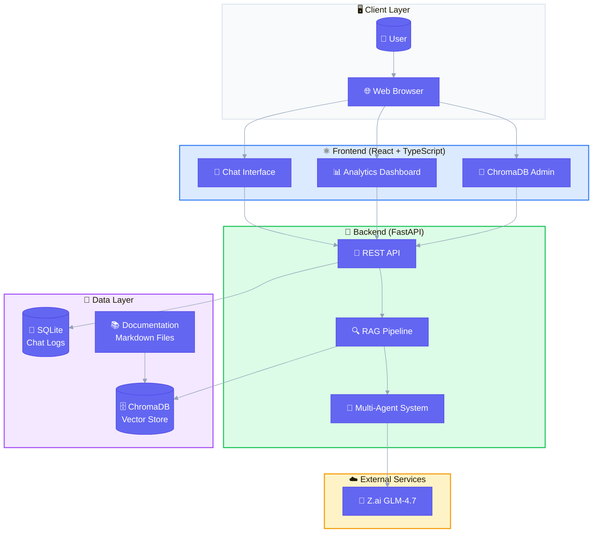
```mermaid
%%{init: {'theme': 'base', 'themeVariables': { 'primaryColor': '#6366f1', 'primaryTextColor': '#fff', 'primaryBorderColor': '#4f46e5', 'lineColor': '#94a3b8', 'secondaryColor': '#f1f5f9', 'tertiaryColor': '#e0e7ff'}}}%%

flowchart TB
    subgraph CLIENT["🖥️ Client Layer"]
        USER[("👤 User")]
        BROWSER["🌐 Web Browser"]
    end

    subgraph FRONTEND["⚛️ Frontend (React + TypeScript)"]
        CHAT["💬 Chat Interface"]
        STATS["📊 Analytics Dashboard"]
        ADMIN["🔧 ChromaDB Admin"]
    end

    subgraph BACKEND["🐍 Backend (FastAPI)"]
        API["🔌 REST API"]
        RAG["🔍 RAG Pipeline"]
        AGENTS["🤖 Multi-Agent System"]
    end

    subgraph SERVICES["☁️ External Services"]
        LLM["🧠 Z.ai GLM-4.7"]
    end

    subgraph STORAGE["💾 Data Layer"]
        CHROMA[("🗄️ ChromaDB\nVector Store")]
        SQLITE[("📝 SQLite\nChat Logs")]
        DOCS["📚 Documentation\nMarkdown Files"]
    end

    USER --> BROWSER
    BROWSER --> CHAT
    BROWSER --> STATS
    BROWSER --> ADMIN

    CHAT --> API
    STATS --> API
    ADMIN --> API

    API --> RAG
    RAG --> AGENTS
    AGENTS --> LLM

    RAG --> CHROMA
    API --> SQLITE
    DOCS --> CHROMA

    style CLIENT fill:#f8fafc,stroke:#e2e8f0,stroke-width:2px
    style FRONTEND fill:#dbeafe,stroke:#3b82f6,stroke-width:2px
    style BACKEND fill:#dcfce7,stroke:#22c55e,stroke-width:2px
    style SERVICES fill:#fef3c7,stroke:#f59e0b,stroke-width:2px
    style STORAGE fill:#f3e8ff,stroke:#a855f7,stroke-width:2px
```

---

## Infrastructure Architecture

### Production Deployment Stack

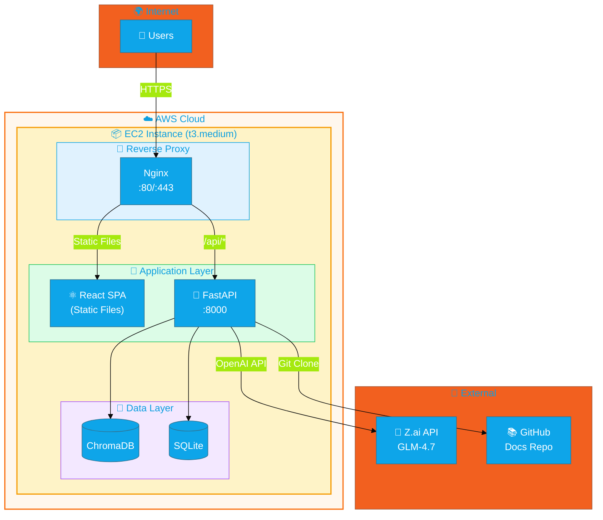
```mermaid
%%{init: {'theme': 'base', 'themeVariables': { 'primaryColor': '#0ea5e9', 'primaryTextColor': '#fff'}}}%%

flowchart TB
    subgraph INTERNET["🌍 Internet"]
        USERS["👥 Users"]
    end

    subgraph AWS["☁️ AWS Cloud"]
        subgraph EC2["📦 EC2 Instance (t3.medium)"]
            subgraph NGINX_LAYER["🔀 Reverse Proxy"]
                NGINX["Nginx\n:80/:443"]
            end

            subgraph APP_LAYER["🚀 Application Layer"]
                direction LR
                FE["⚛️ React SPA\n(Static Files)"]
                BE["🐍 FastAPI\n:8000"]
            end

            subgraph DATA_LAYER["💾 Data Layer"]
                direction LR
                CHROMA_DB[("ChromaDB")]
                SQLITE_DB[("SQLite")]
            end
        end
    end

    subgraph EXTERNAL["🔗 External"]
        ZAI["🧠 Z.ai API\nGLM-4.7"]
        GITHUB["📚 GitHub\nDocs Repo"]
    end

    USERS -->|"HTTPS"| NGINX
    NGINX -->|"Static Files"| FE
    NGINX -->|"/api/*"| BE

    BE --> CHROMA_DB
    BE --> SQLITE_DB
    BE -->|"OpenAI API"| ZAI
    BE -->|"Git Clone"| GITHUB

    style AWS fill:#fff7ed,stroke:#f97316,stroke-width:2px
    style EC2 fill:#fef3c7,stroke:#f59e0b,stroke-width:2px
    style NGINX_LAYER fill:#e0f2fe,stroke:#0ea5e9,stroke-width:1px
    style APP_LAYER fill:#dcfce7,stroke:#22c55e,stroke-width:1px
    style DATA_LAYER fill:#f3e8ff,stroke:#a855f7,stroke-width:1px
```

### Docker Deployment

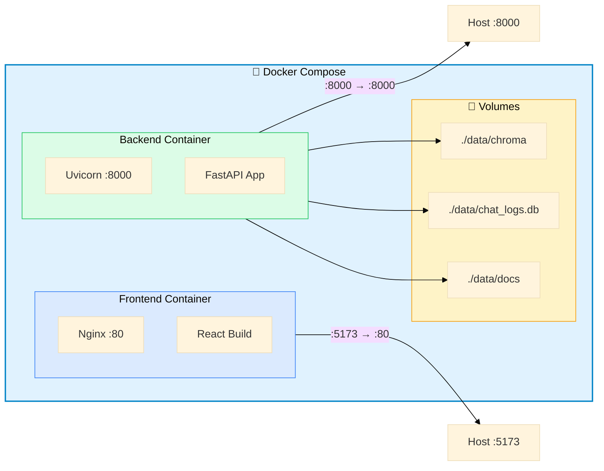
```mermaid
%%{init: {'theme': 'base'}}%%

flowchart LR
    subgraph DOCKER["🐳 Docker Compose"]
        direction TB

        subgraph FE_CONTAINER["Frontend Container"]
            NGINX_FE["Nginx :80"]
            REACT["React Build"]
        end

        subgraph BE_CONTAINER["Backend Container"]
            UVICORN["Uvicorn :8000"]
            FASTAPI["FastAPI App"]
        end

        subgraph VOLUMES["📁 Volumes"]
            V_CHROMA["./data/chroma"]
            V_LOGS["./data/chat_logs.db"]
            V_DOCS["./data/docs"]
        end
    end

    FE_CONTAINER -->|":5173 → :80"| HOST_FE["Host :5173"]
    BE_CONTAINER -->|":8000 → :8000"| HOST_BE["Host :8000"]

    BE_CONTAINER --> V_CHROMA
    BE_CONTAINER --> V_LOGS
    BE_CONTAINER --> V_DOCS

    style DOCKER fill:#e0f2fe,stroke:#0284c7,stroke-width:2px
    style FE_CONTAINER fill:#dbeafe,stroke:#3b82f6,stroke-width:1px
    style BE_CONTAINER fill:#dcfce7,stroke:#22c55e,stroke-width:1px
    style VOLUMES fill:#fef3c7,stroke:#f59e0b,stroke-width:1px
```

---

## Multi-Agent System

### Agent Pipeline (Manager-Worker Pattern)

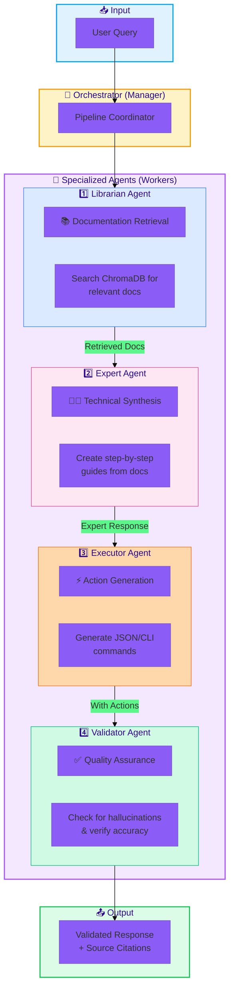
```mermaid
%%{init: {'theme': 'base', 'themeVariables': { 'primaryColor': '#8b5cf6'}}}%%

flowchart TB
    subgraph INPUT["📥 Input"]
        QUERY["User Query"]
    end

    subgraph ORCHESTRATOR["🎯 Orchestrator (Manager)"]
        COORD["Pipeline Coordinator"]
    end

    subgraph AGENTS["🤖 Specialized Agents (Workers)"]
        direction TB

        subgraph A1["1️⃣ Librarian Agent"]
            L_DESC["📚 Documentation Retrieval"]
            L_TASK["Search ChromaDB for\nrelevant docs"]
        end

        subgraph A2["2️⃣ Expert Agent"]
            E_DESC["👨‍🏫 Technical Synthesis"]
            E_TASK["Create step-by-step\nguides from docs"]
        end

        subgraph A3["3️⃣ Executor Agent"]
            X_DESC["⚡ Action Generation"]
            X_TASK["Generate JSON/CLI\ncommands"]
        end

        subgraph A4["4️⃣ Validator Agent"]
            V_DESC["✅ Quality Assurance"]
            V_TASK["Check for hallucinations\n& verify accuracy"]
        end
    end

    subgraph OUTPUT["📤 Output"]
        RESPONSE["Validated Response\n+ Source Citations"]
    end

    QUERY --> COORD
    COORD --> A1
    A1 -->|"Retrieved Docs"| A2
    A2 -->|"Expert Response"| A3
    A3 -->|"With Actions"| A4
    A4 --> RESPONSE

    style INPUT fill:#e0f2fe,stroke:#0ea5e9,stroke-width:2px
    style ORCHESTRATOR fill:#fef3c7,stroke:#f59e0b,stroke-width:2px
    style AGENTS fill:#f3e8ff,stroke:#a855f7,stroke-width:2px
    style OUTPUT fill:#dcfce7,stroke:#22c55e,stroke-width:2px
    style A1 fill:#dbeafe,stroke:#3b82f6
    style A2 fill:#fce7f3,stroke:#ec4899
    style A3 fill:#fed7aa,stroke:#f97316
    style A4 fill:#d1fae5,stroke:#10b981
```

### Agent Responsibilities

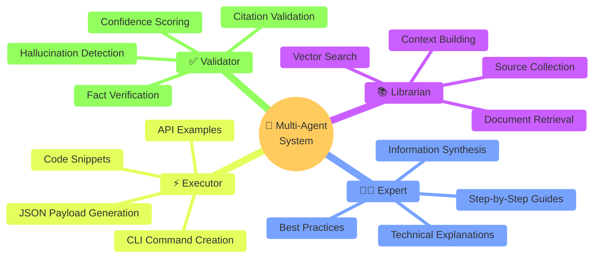
```mermaid
%%{init: {'theme': 'base'}}%%

mindmap
  root((🤖 Multi-Agent<br/>System))
    📚 Librarian
      Vector Search
      Document Retrieval
      Context Building
      Source Collection
    👨‍🏫 Expert
      Information Synthesis
      Step-by-Step Guides
      Technical Explanations
      Best Practices
    ⚡ Executor
      JSON Payload Generation
      CLI Command Creation
      API Examples
      Code Snippets
    ✅ Validator
      Hallucination Detection
      Fact Verification
      Confidence Scoring
      Citation Validation
```

---

## RAG Pipeline Flow

### Retrieval-Augmented Generation Process

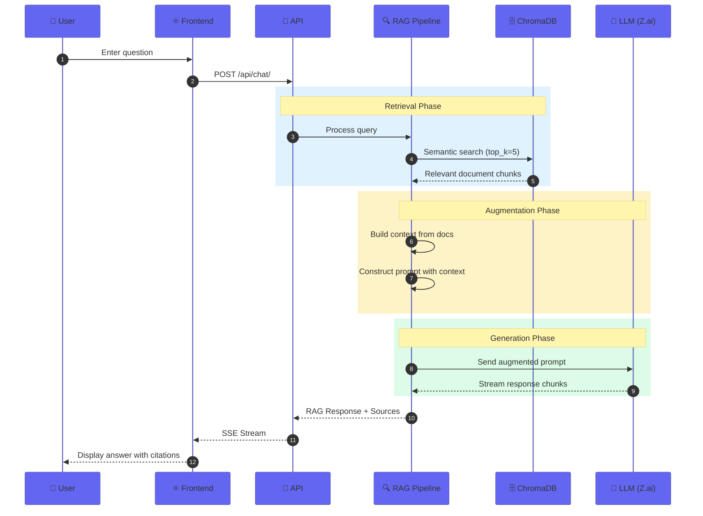
```mermaid
%%{init: {'theme': 'base', 'themeVariables': { 'primaryColor': '#6366f1'}}}%%

sequenceDiagram
    autonumber

    participant U as 👤 User
    participant F as ⚛️ Frontend
    participant A as 🔌 API
    participant R as 🔍 RAG Pipeline
    participant C as 🗄️ ChromaDB
    participant L as 🧠 LLM (Z.ai)

    U->>F: Enter question
    F->>A: POST /api/chat/

    rect rgb(224, 242, 254)
        Note over A,C: Retrieval Phase
        A->>R: Process query
        R->>C: Semantic search (top_k=5)
        C-->>R: Relevant document chunks
    end

    rect rgb(254, 243, 199)
        Note over R,L: Augmentation Phase
        R->>R: Build context from docs
        R->>R: Construct prompt with context
    end

    rect rgb(220, 252, 231)
        Note over R,L: Generation Phase
        R->>L: Send augmented prompt
        L-->>R: Stream response chunks
    end

    R-->>A: RAG Response + Sources
    A-->>F: SSE Stream
    F-->>U: Display answer with citations
```

### Document Processing Pipeline

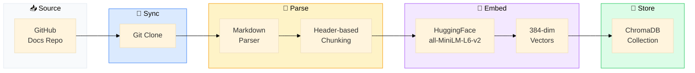
```mermaid
%%{init: {'theme': 'base'}}%%

flowchart LR
    subgraph SOURCE["📥 Source"]
        GH["GitHub\nDocs Repo"]
    end

    subgraph SYNC["🔄 Sync"]
        CLONE["Git Clone"]
    end

    subgraph PARSE["📄 Parse"]
        MD["Markdown\nParser"]
        CHUNK["Header-based\nChunking"]
    end

    subgraph EMBED["🔢 Embed"]
        HF["HuggingFace\nall-MiniLM-L6-v2"]
        VEC["384-dim\nVectors"]
    end

    subgraph STORE["💾 Store"]
        CHROMA["ChromaDB\nCollection"]
    end

    GH --> CLONE
    CLONE --> MD
    MD --> CHUNK
    CHUNK --> HF
    HF --> VEC
    VEC --> CHROMA

    style SOURCE fill:#f8fafc,stroke:#e2e8f0
    style SYNC fill:#dbeafe,stroke:#3b82f6
    style PARSE fill:#fef3c7,stroke:#f59e0b
    style EMBED fill:#f3e8ff,stroke:#a855f7
    style STORE fill:#dcfce7,stroke:#22c55e
```

---

## User Flows

### Flow 1: Chat Conversation

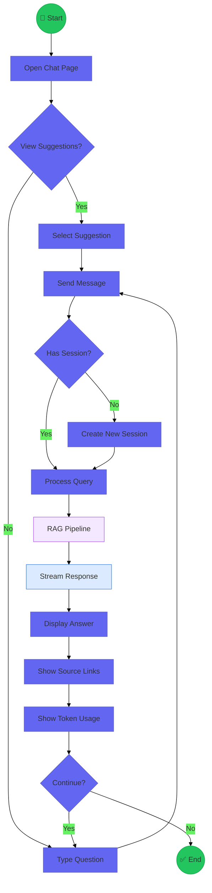
```mermaid
%%{init: {'theme': 'base', 'themeVariables': { 'primaryColor': '#6366f1'}}}%%

flowchart TB
    START((🚀 Start)) --> OPEN[Open Chat Page]
    OPEN --> SUGGEST{View Suggestions?}

    SUGGEST -->|Yes| SELECT[Select Suggestion]
    SUGGEST -->|No| TYPE[Type Question]

    SELECT --> SEND[Send Message]
    TYPE --> SEND

    SEND --> SESSION{Has Session?}
    SESSION -->|No| CREATE[Create New Session]
    SESSION -->|Yes| QUERY[Process Query]
    CREATE --> QUERY

    QUERY --> RAG[RAG Pipeline]
    RAG --> STREAM[Stream Response]

    STREAM --> DISPLAY[Display Answer]
    DISPLAY --> SOURCES[Show Source Links]
    SOURCES --> STATS[Show Token Usage]

    STATS --> CONTINUE{Continue?}
    CONTINUE -->|Yes| TYPE
    CONTINUE -->|No| END((✅ End))

    style START fill:#22c55e,stroke:#16a34a
    style END fill:#22c55e,stroke:#16a34a
    style RAG fill:#f3e8ff,stroke:#a855f7
    style STREAM fill:#dbeafe,stroke:#3b82f6
```

### Flow 2: Analytics Dashboard

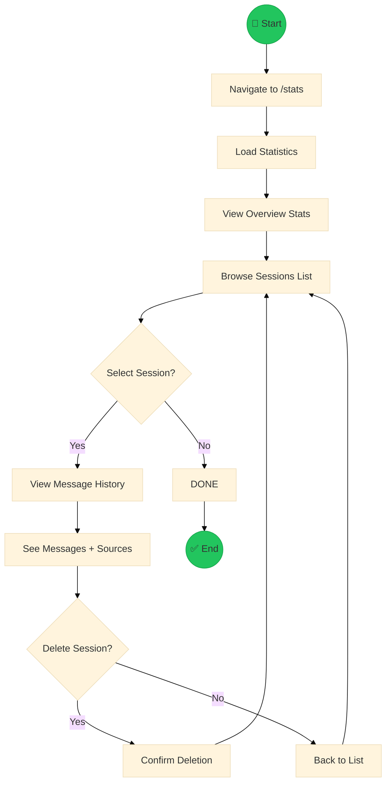
```mermaid
%%{init: {'theme': 'base'}}%%

flowchart TB
    START((🚀 Start)) --> NAV[Navigate to /stats]
    NAV --> LOAD[Load Statistics]

    LOAD --> VIEW[View Overview Stats]
    VIEW --> SESSIONS[Browse Sessions List]

    SESSIONS --> SELECT{Select Session?}
    SELECT -->|Yes| HISTORY[View Message History]
    SELECT -->|No| DONE

    HISTORY --> DETAILS[See Messages + Sources]
    DETAILS --> DELETE{Delete Session?}

    DELETE -->|Yes| CONFIRM[Confirm Deletion]
    DELETE -->|No| BACK[Back to List]

    CONFIRM --> SESSIONS
    BACK --> SESSIONS

    DONE --> END((✅ End))

    style START fill:#22c55e,stroke:#16a34a
    style END fill:#22c55e,stroke:#16a34a
```

### Flow 3: Admin ChromaDB Management

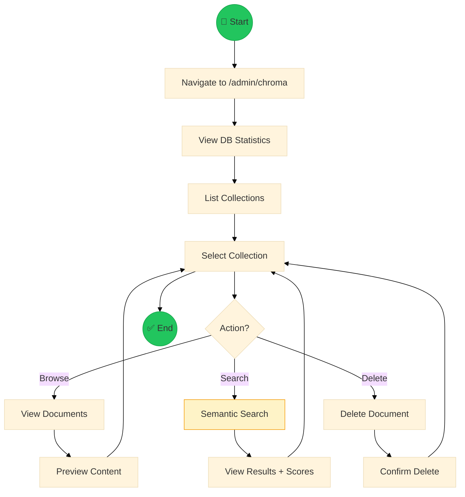
```mermaid
%%{init: {'theme': 'base'}}%%

flowchart TB
    START((🚀 Start)) --> NAV[Navigate to /admin/chroma]
    NAV --> STATS[View DB Statistics]

    STATS --> LIST[List Collections]
    LIST --> SELECT[Select Collection]

    SELECT --> BROWSE{Action?}

    BROWSE -->|Browse| DOCS[View Documents]
    BROWSE -->|Search| SEARCH[Semantic Search]
    BROWSE -->|Delete| DEL[Delete Document]

    DOCS --> PREVIEW[Preview Content]
    SEARCH --> RESULTS[View Results + Scores]
    DEL --> CONFIRM[Confirm Delete]

    PREVIEW --> SELECT
    RESULTS --> SELECT
    CONFIRM --> SELECT

    SELECT --> END((✅ End))

    style START fill:#22c55e,stroke:#16a34a
    style END fill:#22c55e,stroke:#16a34a
    style SEARCH fill:#fef3c7,stroke:#f59e0b
```

---

## API Architecture

### Endpoint Structure

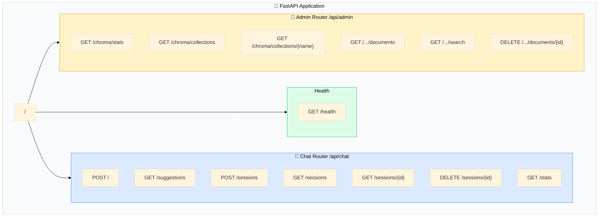
```mermaid
%%{init: {'theme': 'base'}}%%

flowchart TB
    subgraph API["🔌 FastAPI Application"]
        ROOT["/"]

        subgraph HEALTH["Health"]
            H1["GET /health"]
        end

        subgraph CHAT["💬 Chat Router /api/chat"]
            C1["POST /"]
            C2["GET /suggestions"]
            C3["POST /sessions"]
            C4["GET /sessions"]
            C5["GET /sessions/{id}"]
            C6["DELETE /sessions/{id}"]
            C7["GET /stats"]
        end

        subgraph ADMIN["🔧 Admin Router /api/admin"]
            A1["GET /chroma/stats"]
            A2["GET /chroma/collections"]
            A3["GET /chroma/collections/{name}"]
            A4["GET /.../documents"]
            A5["GET /.../search"]
            A6["DELETE /.../documents/{id}"]
        end
    end

    ROOT --> HEALTH
    ROOT --> CHAT
    ROOT --> ADMIN

    style API fill:#f8fafc,stroke:#e2e8f0,stroke-width:2px
    style HEALTH fill:#dcfce7,stroke:#22c55e
    style CHAT fill:#dbeafe,stroke:#3b82f6
    style ADMIN fill:#fef3c7,stroke:#f59e0b
```

### Request/Response Flow

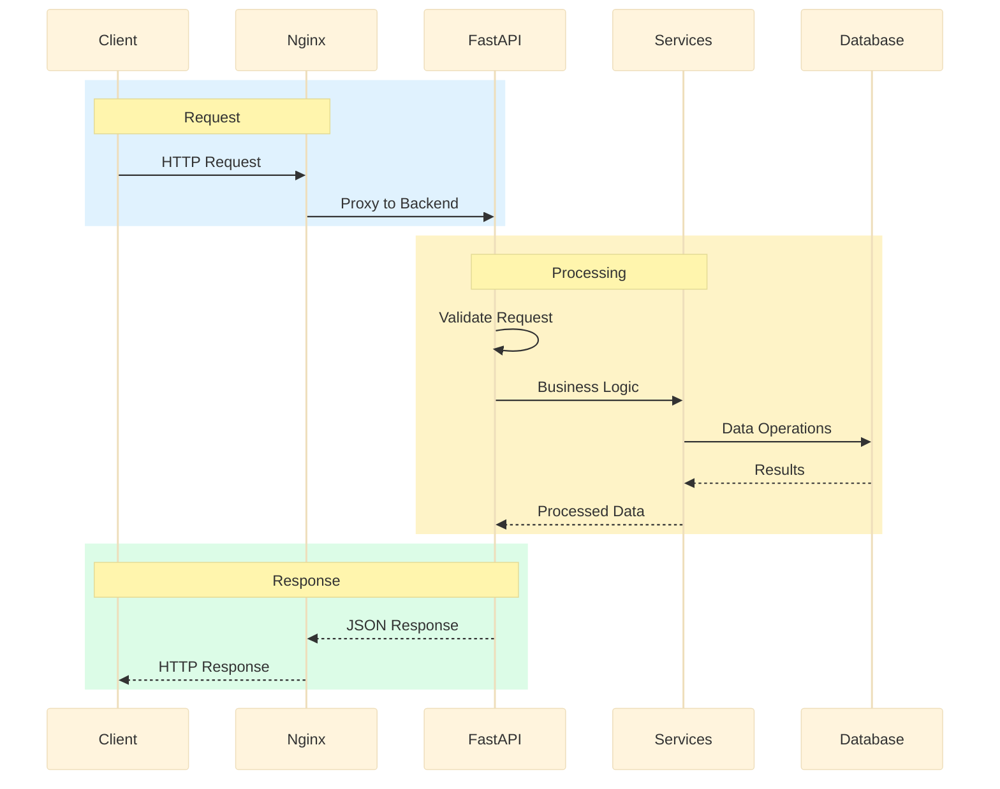
```mermaid
%%{init: {'theme': 'base'}}%%

sequenceDiagram
    participant C as Client
    participant N as Nginx
    participant F as FastAPI
    participant S as Services
    participant D as Database

    rect rgb(224, 242, 254)
        Note over C,N: Request
        C->>N: HTTP Request
        N->>F: Proxy to Backend
    end

    rect rgb(254, 243, 199)
        Note over F,S: Processing
        F->>F: Validate Request
        F->>S: Business Logic
        S->>D: Data Operations
        D-->>S: Results
        S-->>F: Processed Data
    end

    rect rgb(220, 252, 231)
        Note over F,C: Response
        F-->>N: JSON Response
        N-->>C: HTTP Response
    end
```

---

## Data Flow

### Real-time Streaming Architecture

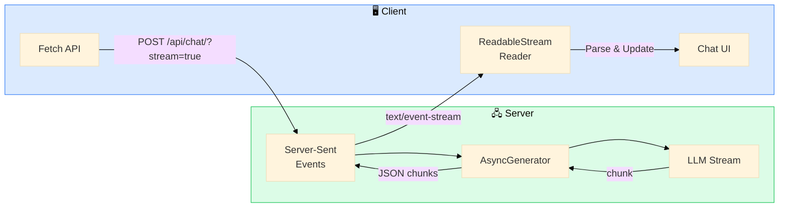
```mermaid
%%{init: {'theme': 'base'}}%%

flowchart LR
    subgraph CLIENT["🖥️ Client"]
        FETCH["Fetch API"]
        READER["ReadableStream\nReader"]
        UI["Chat UI"]
    end

    subgraph SERVER["🖧 Server"]
        SSE["Server-Sent\nEvents"]
        ASYNC["AsyncGenerator"]
        LLM_STREAM["LLM Stream"]
    end

    FETCH -->|"POST /api/chat/?stream=true"| SSE
    SSE --> ASYNC
    ASYNC --> LLM_STREAM

    LLM_STREAM -->|"chunk"| ASYNC
    ASYNC -->|"JSON chunks"| SSE
    SSE -->|"text/event-stream"| READER
    READER -->|"Parse & Update"| UI

    style CLIENT fill:#dbeafe,stroke:#3b82f6
    style SERVER fill:#dcfce7,stroke:#22c55e
```

### Data Storage Architecture

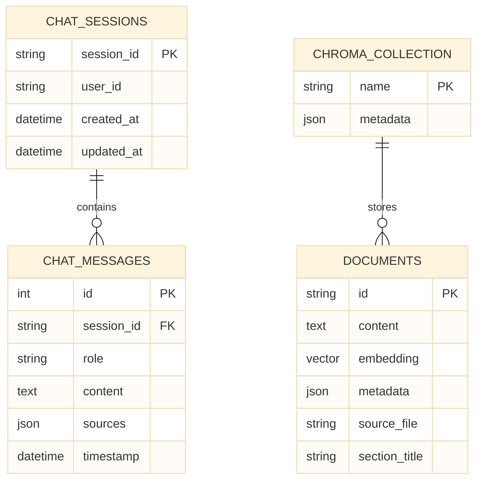
```mermaid
%%{init: {'theme': 'base'}}%%

erDiagram
    CHAT_SESSIONS ||--o{ CHAT_MESSAGES : contains
    CHROMA_COLLECTION ||--o{ DOCUMENTS : stores

    CHAT_SESSIONS {
        string session_id PK
        string user_id
        datetime created_at
        datetime updated_at
    }

    CHAT_MESSAGES {
        int id PK
        string session_id FK
        string role
        text content
        json sources
        datetime timestamp
    }

    CHROMA_COLLECTION {
        string name PK
        json metadata
    }

    DOCUMENTS {
        string id PK
        text content
        vector embedding
        json metadata
        string source_file
        string section_title
    }
```

---

## Tech Stack Overview

### Technology Layers

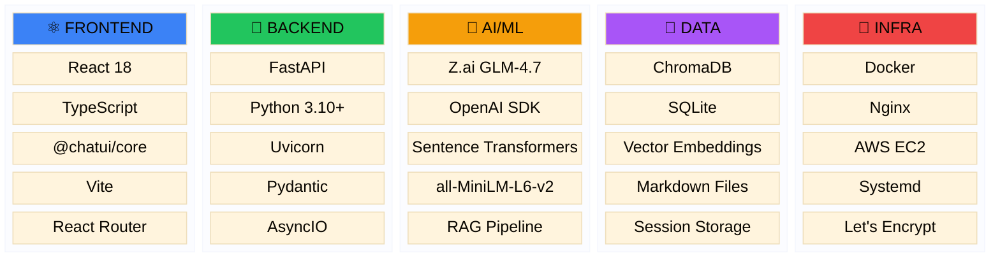
```mermaid
%%{init: {'theme': 'base'}}%%

block-beta
    columns 5

    block:frontend:1
        columns 1
        F_TITLE["⚛️ FRONTEND"]
        F1["React 18"]
        F2["TypeScript"]
        F3["@chatui/core"]
        F4["Vite"]
        F5["React Router"]
    end

    block:backend:1
        columns 1
        B_TITLE["🐍 BACKEND"]
        B1["FastAPI"]
        B2["Python 3.10+"]
        B3["Uvicorn"]
        B4["Pydantic"]
        B5["AsyncIO"]
    end

    block:ai:1
        columns 1
        A_TITLE["🧠 AI/ML"]
        A1["Z.ai GLM-4.7"]
        A2["OpenAI SDK"]
        A3["Sentence Transformers"]
        A4["all-MiniLM-L6-v2"]
        A5["RAG Pipeline"]
    end

    block:data:1
        columns 1
        D_TITLE["💾 DATA"]
        D1["ChromaDB"]
        D2["SQLite"]
        D3["Vector Embeddings"]
        D4["Markdown Files"]
        D5["Session Storage"]
    end

    block:infra:1
        columns 1
        I_TITLE["🚀 INFRA"]
        I1["Docker"]
        I2["Nginx"]
        I3["AWS EC2"]
        I4["Systemd"]
        I5["Let's Encrypt"]
    end

    style F_TITLE fill:#3b82f6,color:#fff
    style B_TITLE fill:#22c55e,color:#fff
    style A_TITLE fill:#f59e0b,color:#fff
    style D_TITLE fill:#a855f7,color:#fff
    style I_TITLE fill:#ef4444,color:#fff
```

### Component Dependencies

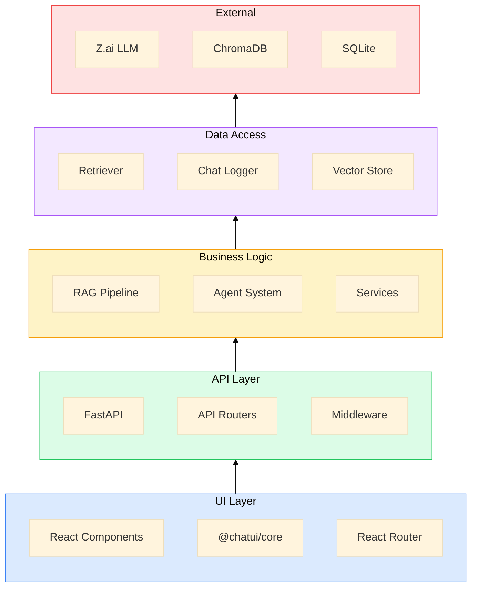
```mermaid
%%{init: {'theme': 'base'}}%%

flowchart BT
    subgraph UI["UI Layer"]
        REACT["React Components"]
        CHATUI["@chatui/core"]
        ROUTER["React Router"]
    end

    subgraph API_LAYER["API Layer"]
        FASTAPI["FastAPI"]
        ROUTERS["API Routers"]
        MIDDLEWARE["Middleware"]
    end

    subgraph BUSINESS["Business Logic"]
        RAG["RAG Pipeline"]
        AGENTS["Agent System"]
        SERVICES["Services"]
    end

    subgraph DATA["Data Access"]
        RETRIEVER["Retriever"]
        CHATLOG["Chat Logger"]
        VECTORSTORE["Vector Store"]
    end

    subgraph EXTERNAL["External"]
        LLM["Z.ai LLM"]
        CHROMA["ChromaDB"]
        SQLITE["SQLite"]
    end

    UI --> API_LAYER
    API_LAYER --> BUSINESS
    BUSINESS --> DATA
    DATA --> EXTERNAL

    style UI fill:#dbeafe,stroke:#3b82f6
    style API_LAYER fill:#dcfce7,stroke:#22c55e
    style BUSINESS fill:#fef3c7,stroke:#f59e0b
    style DATA fill:#f3e8ff,stroke:#a855f7
    style EXTERNAL fill:#fee2e2,stroke:#ef4444
```

---

## Deployment Architecture

### Development Environment

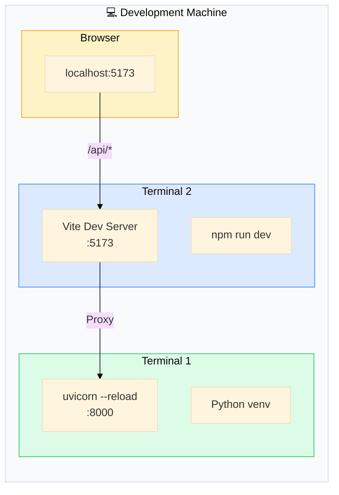
```mermaid
%%{init: {'theme': 'base'}}%%

flowchart LR
    subgraph DEV["💻 Development Machine"]
        subgraph TERM1["Terminal 1"]
            VENV["Python venv"]
            UVICORN["uvicorn --reload\n:8000"]
        end

        subgraph TERM2["Terminal 2"]
            NPM["npm run dev"]
            VITE["Vite Dev Server\n:5173"]
        end

        subgraph BROWSER["Browser"]
            APP["localhost:5173"]
        end
    end

    APP -->|"/api/*"| VITE
    VITE -->|"Proxy"| UVICORN

    style DEV fill:#f8fafc,stroke:#e2e8f0,stroke-width:2px
    style TERM1 fill:#dcfce7,stroke:#22c55e
    style TERM2 fill:#dbeafe,stroke:#3b82f6
    style BROWSER fill:#fef3c7,stroke:#f59e0b
```

### Production Environment

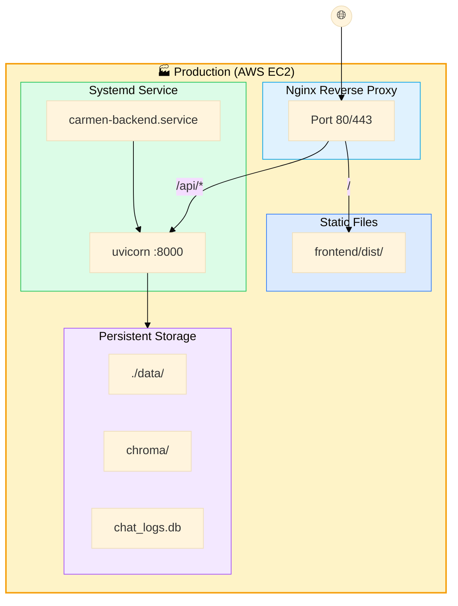
```mermaid
%%{init: {'theme': 'base'}}%%

flowchart TB
    subgraph PROD["🏭 Production (AWS EC2)"]

        subgraph PROXY["Nginx Reverse Proxy"]
            N80["Port 80/443"]
        end

        subgraph STATIC["Static Files"]
            DIST["frontend/dist/"]
        end

        subgraph SYSTEMD["Systemd Service"]
            BACKEND["carmen-backend.service"]
            UVICORN_PROD["uvicorn :8000"]
        end

        subgraph PERSIST["Persistent Storage"]
            DATA_DIR["./data/"]
            CHROMA_DIR["chroma/"]
            LOGS_DB["chat_logs.db"]
        end
    end

    INTERNET((🌐)) --> N80
    N80 -->|"/"| DIST
    N80 -->|"/api/*"| UVICORN_PROD
    BACKEND --> UVICORN_PROD
    UVICORN_PROD --> PERSIST

    style PROD fill:#fef3c7,stroke:#f59e0b,stroke-width:2px
    style PROXY fill:#e0f2fe,stroke:#0ea5e9
    style STATIC fill:#dbeafe,stroke:#3b82f6
    style SYSTEMD fill:#dcfce7,stroke:#22c55e
    style PERSIST fill:#f3e8ff,stroke:#a855f7
```

---

## Quick Reference

### Port Mapping

| Environment | Frontend | Backend | Purpose |
|-------------|----------|---------|---------|
| Development | 5173 | 8000 | Local development |
| Docker | 5173 (→80) | 8000 | Container deployment |
| Production | 80/443 | 8000 (internal) | AWS EC2 with Nginx |

### Key Directories

```
carmen.help/
├── backend/
│   ├── agents/          # Multi-agent system
│   ├── api/             # FastAPI routes
│   ├── services/        # Business logic
│   └── knowledge_base/  # RAG components
├── frontend/
│   └── src/pages/       # React pages
├── data/
│   ├── chroma/          # Vector database
│   ├── docs/            # Cloned documentation
│   └── chat_logs.db     # SQLite database
└── docker-compose.yml   # Container orchestration
```

### Environment Variables

| Variable | Purpose | Required |
|----------|---------|----------|
| `ZAI_API_KEY` | LLM API authentication | ✅ |
| `ZAI_API_BASE` | LLM API endpoint | ✅ |
| `ZAI_MODEL` | LLM model name | ✅ |
| `CHROMA_PERSIST_DIR` | Vector DB path | ✅ |
| `DOCS_REPO_URL` | Documentation source | ✅ |
| `DOCS_SITE_URL` | Citation base URL | ✅ |

---

<div align="center">

**[← Back to README](README.md)**

</div>
